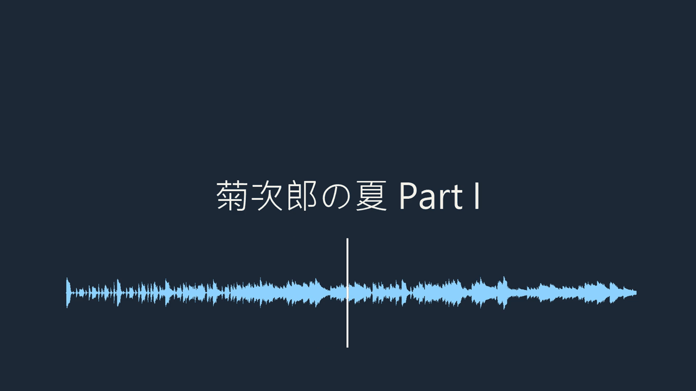
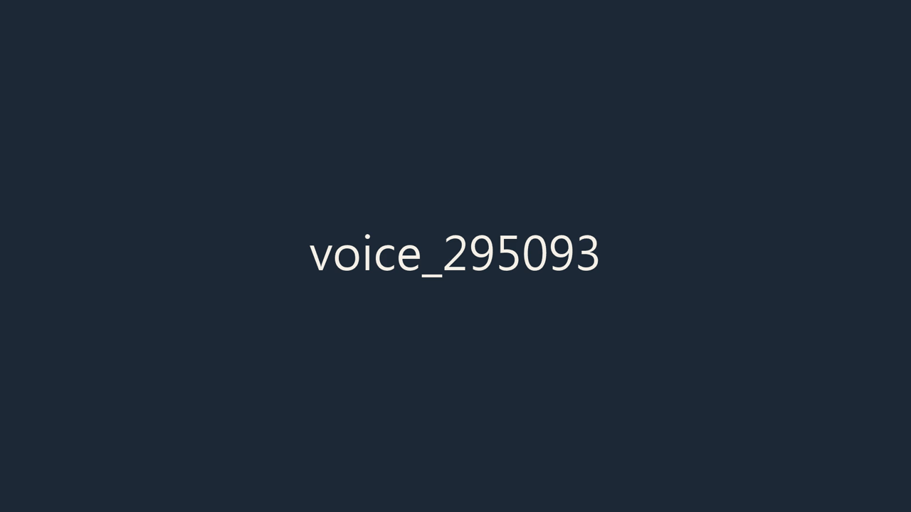

# soundstage

[](https://github.com/joechiboo/soundstage/actions/workflows/ci.yml)

把錄音做成影片、上傳到 YouTube 的 CLI 工具。

起因是想把鋼琴練習錄音放上 YouTube，但每次都要手動開剪輯軟體、貼封面、輸出、
填表單、上傳。這些步驟每支影片都一樣，值得寫成一行指令。

```bash
uv run soundstage publish 演奏.wav --meta meta.yaml --cover cover.jpg --visual waveform
```

一行做完：合成影片 → 讀 metadata → OAuth → 上傳 → 套縮圖。

## 兩種視覺化樣式

**`--visual waveform`** — 整首的波形圖加上隨音樂移動的播放頭。波形看得出樂曲的
強弱起伏與分句：



**`--visual static`（預設）** — 單純的靜態封面。沒給 `--cover` 時會自動用純色
背景加檔名文字：



---

## 前置需求

- Python 3.11+
- [uv](https://docs.astral.sh/uv/)
- **ffmpeg**（render 的核心，必須先裝好、在 PATH 上）

  ```bash
  brew install ffmpeg          # macOS
  sudo apt install ffmpeg      # Ubuntu / Debian
  winget install ffmpeg        # Windows
  ```

  > Windows 上如果沒有 winget，或 gyan.dev 的下載卡住，可以改用
  > [BtbN 的 GitHub build](https://github.com/BtbN/FFmpeg-Builds/releases)。

## 安裝

```bash
git clone https://github.com/joechiboo/soundstage.git
cd soundstage
uv sync
```

之後用 `uv run soundstage ...` 執行，或 `uv tool install .` 裝成全域指令。

## 快速開始

```bash
# 音檔 + 封面圖 → mp4
uv run soundstage render input.wav --cover cover.jpg -o out.mp4

# 沒有封面圖也可以：自動用純色背景 + 檔名文字
uv run soundstage render input.wav

# 輸入也可以是影片檔（例如手機錄的演奏影片），只取其中的音訊軌
uv run soundstage render recording.mp4 --cover cover.jpg -o out.mp4

# 波形視覺化
uv run soundstage render input.wav --visual waveform --cover cover.jpg -o out.mp4

# 除錯時看實際執行的 ffmpeg 指令
uv run soundstage render input.wav -v
```

其他選項：`--width` / `--height`（預設 1920×1080）、`--fps`（預設 30）、
`--visual`（`static` 預設／`waveform`）。`publish` 也吃 `--visual`。
解析度必須是偶數，這是 H.264 的限制。

輸入可以是任何 ffmpeg 讀得懂的音訊或影片檔。影像一律取自封面圖，
輸入檔自己夾帶的畫面（影片的視訊軌、mp3 的內嵌專輯封面）都會被忽略。

## metadata 設定檔

`upload` / `publish` 用 yaml（或 json）管理影片資訊，範例見
[`examples/meta.yaml`](examples/meta.yaml)：

```yaml
title: 月光奏鳴曲 第一樂章
description: |
  鋼琴練習錄音。
tags: [piano, beethoven, 古典樂]
privacy: unlisted   # private / unlisted / public，預設 private
thumbnail: cover.jpg  # 相對路徑以設定檔所在目錄為準（可省略）
```

長度限制（標題 100 字元、說明 5000、標籤加總 500）在本機就先擋下來，
不用等上傳後才被 API 退件。

## 上傳到 YouTube

```bash
uv sync --extra upload   # 上傳相依是選用的
```

設定流程見 **[docs/youtube-setup.md](docs/youtube-setup.md)**（七個步驟，附檢查點
與疑難排解）；設定完成後的日常維運見
**[docs/oauth-operations.md](docs/oauth-operations.md)**（token 壽命、重新授權、
測試使用者管理）。

```bash
# 上傳現成的影片
uv run soundstage upload out.mp4 --meta meta.yaml

# render + upload 一次做完
uv run soundstage publish input.wav --meta meta.yaml --cover cover.jpg

# 臨時覆蓋設定檔裡的公開狀態
uv run soundstage upload out.mp4 --meta meta.yaml --privacy public
```

- 用 resumable upload，中途遇到 5xx 或連線中斷會自動退避重試（最多 5 次）
- 終端機下會顯示上傳進度百分比
- `meta.thumbnail` 有設定時會在上傳後套用縮圖；縮圖失敗不影響影片，
  訊息會附上影片網址提醒不需要重傳
- `publish` 會**先驗證 metadata 再 render**，避免花時間編碼完才發現設定檔有問題
- 只申請 `youtube.upload` 範圍，沒有讀取或修改既有影片的權限

授權相關指令：

```bash
uv run soundstage auth              # 開瀏覽器完成授權
uv run soundstage auth --status     # 查看憑證與 token 狀態
uv run soundstage auth --reset      # 清除 token，下次重新授權
uv run soundstage auth --no-browser # 遠端主機：改在終端機顯示授權網址
```

**配額**：YouTube Data API 每日預設 10,000 點，上傳一支影片約耗 **1,600 點**，
一天大約只能傳 6 支。超過會收到 HTTP 403 `quotaExceeded`，太平洋時間午夜重置。

---

## 工程筆記

### 這個專案最主要的 bug 類型：ffmpeg 說成功，輸出是錯的

包 ffmpeg 最難的不是把指令組對，而是**組錯的時候它經常不告訴你**。
退出碼 0、stderr 乾淨、終端機印出「已輸出影片」，但檔案內容是錯的。

開發過程中踩到四個，全部同一類，全部只有拿真實檔案跑才會浮現：

| 症狀 | 根因 | 修法 |
|---|---|---|
| `--cover` 被無聲忽略，畫面變成輸入影片的內容 | 沒寫 `-map`，ffmpeg 預設挑「解析度最高」的影像串流 | `-map 0:v:0` / `-map 1:a:0` 明確指定 |
| 影片尾巴多出約 2 秒無聲畫面 | `-loop 1` 的封面是無限長串流，`-shortest` 收不乾淨 | 用 ffprobe 探測音訊長度，改用 `-t` 硬切 |
| 整個畫面變成洋紅色 | `blend` 預設在 YUV 上做，`screen` 被套到色度平面 | 兩路輸入進 `blend` 前都 `format=gbrp` |
| 播放頭完全不出現 | `drawbox` 運算式裡的 `t` 是**線寬**不是時間，`n` 沒定義 | 改用 `overlay`，它才有時間變數 |

每一個都補了測試把失敗模式釘死，測試的 docstring 直接寫「為什麼這行不能改」。

最容易漏掉的是第二個的**反轉**：`-t` 設成**正好**等於音訊長度時，音訊編碼器
只能輸出完整的 frame，會少掉最後一格——實測 16 kHz 的 AAC 少 64 ms。修掉 2 秒
的溢出卻換來 64 毫秒的截斷，同樣是靜默的。所以 `-t` 要加一個
`_DURATION_EPSILON = 0.25`，多出來的部分再交給 `-shortest` 收掉。

實測結果（兩支真實素材）：

| 素材 | 輸出音訊 | 輸出影像 |
|---|---|---|
| 62.208s 的 aac | +0.000s | −0.008s |
| 147.752s 的手機錄影 | +0.000s | −0.019s |

### `render/ffmpeg.py` 不執行任何 subprocess

它只做一件事：把 `RenderSpec` 轉成 argv list。執行交給 `renderer.py`。

這樣拆的好處是上面那四個 bug 有一半可以用純函式測試驗到——不需要真的跑 ffmpeg、
不需要準備素材、毫秒級跑完。剩下一半（色彩空間、播放頭位置）才需要真的產出影片
再抽格檢查。

### 波形用 `showwavespic` 而不是 `showwaves`

`showwaves` 是示波器，每一格只畫 `1/fps` 秒的音訊。這有兩個問題：

1. **畫面填不滿**。16 kHz 的素材在 30 fps 下每格只有 533 個取樣，要鋪滿 1920
   像素的寬度，右邊就是空的。
2. **讀不出東西**。每格只看得到 33 毫秒，波形劇烈跳動但沒有資訊量。

`showwavespic` 畫的是整首的波形，配一條隨時間移動的播放頭，反而看得出樂曲的
強弱結構與分句。代價是要先知道音訊總長度——這也是 `probe.py` 存在的原因，
跟上面 `-t` 的需求剛好共用。

另外一個小發現：`showwavespic` 的底色是黑的，而 `screen` 混合遇到黑色不改變
背景，等於免費去背，不需要 colorkey。

### 參數驗證要排在外部相依檢查之前

原本 `render()` 先檢查 `shutil.which("ffmpeg")`，再建 `RenderSpec`（尺寸驗證在
這裡）。結果是沒裝 ffmpeg 的機器上，使用者把解析度打成奇數會被告知「找不到
ffmpeg」，裝完才看到真正的問題。

連帶的症狀是測試會隨環境飄：`test_odd_dimensions_rejected` 在有 ffmpeg 的機器上
過、沒有的機器上掛。現在順序反過來，並用 monkeypatch 模擬「沒有 ffmpeg」把這個
順序釘死。

---

## 開發

```bash
uv sync --extra upload   # 含上傳相依，才能跑到 OAuth 相關測試
uv run pytest
```

測試不碰網路：OAuth 與 YouTube API 都用假 client 替換。
`build_render_command()` / `build_video_body()` 是純函式，可以直接驗證輸出的
argv 與 request body。只跑 `uv sync`（沒有 extra）時 render 一切正常，
upload 會提示缺少套件。

需要真的跑 ffmpeg 的整合測試會用 `skipif` 擋掉，所以沒裝 ffmpeg 也能跑完測試。

CI（[.github/workflows/ci.yml](.github/workflows/ci.yml)）跑 Ubuntu × Python
3.11／3.13 與 Windows × 3.13，三組都裝 ffmpeg，所以那些整合測試在 CI 上會真的
執行。跑 Windows 是刻意的——這個專案已經踩過兩個只在 Windows 出現的問題
（`chmod(0o600)` 無效、主控台 cp950 編碼），本機單平台驗不到。

### 專案結構

```
src/soundstage/
├── cli.py        # typer CLI，只做參數解析與錯誤呈現
├── errors.py     # 共用例外
├── render/       # 音檔 + 封面 → mp4
│   ├── spec.py       # RenderSpec / VisualStyle 型別
│   ├── ffmpeg.py     # 純函式組裝 ffmpeg 指令，不執行 subprocess
│   ├── probe.py      # 用 ffprobe 探測輸入（音訊長度）
│   ├── cover.py      # 預設封面（純色背景 + 檔名）
│   └── renderer.py   # render 流程
├── meta/         # VideoMeta 型別 + yaml/json 載入
└── upload/       # YouTube 上傳
    ├── auth.py       # OAuth 2.0 流程與 token 快取
    ├── youtube.py    # request body 組裝（純函式）+ resumable upload
    └── uploader.py   # upload 流程
```

模組之間只透過各自 `__init__.py` 匯出的型別與函式溝通。視覺化樣式是預留的
擴充點：在 `render/ffmpeg.py` 的 `_COMMAND_BUILDERS` 註冊新的指令組裝函式即可。

已知問題與待辦見 [TODO.md](TODO.md)。

## Roadmap

- [x] render：靜態封面
- [x] upload：YouTube Data API v3 + OAuth 2.0
- [x] render：波形視覺化（`showwavespic` + 播放頭）
- [ ] render：頻譜視覺化（`showspectrum`）
